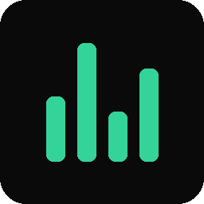
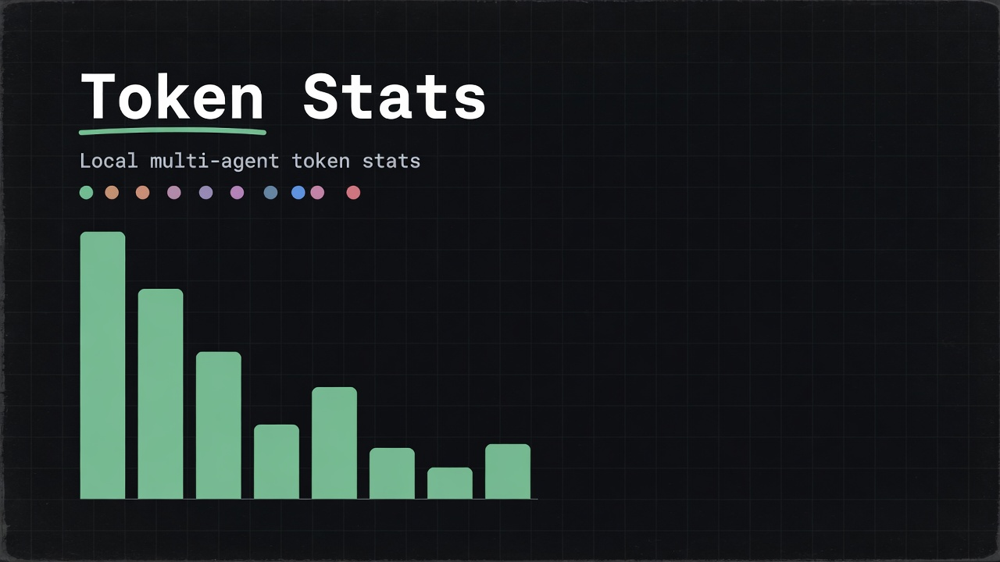
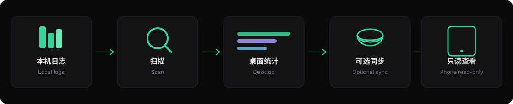

<p align="center">
  
</p>

<h1 align="center">Token Stats</h1>

<p align="center">
  <a href="./README.md">中文</a> · <a href="./README.en.md">English</a>
</p>

<p align="center">
  
  
  
  
</p>

<p align="center">
  <b>本机多 Agent 会话 Token 用量统计</b><br>
  桌面扫描本地日志 · 可选同步到你自己的云 · 手机只读查看
</p>

<p align="center">
  
</p>

| | |
|---|---|
| 作者 | **CCingh** |
| 邮箱 | **ccingh@proton.me** |
| 仓库 | https://github.com/ccingh/token-stats |

---

## 怎么走数据

本机日志进桌面；云同步是可选项，只传统计快照。对话正文不会离开这台电脑。

<p align="center">
  
</p>

---

## 特性

| | |
|---|---|
| **本地扫描** | 直接读各 Agent 落盘数据，不经过第三方统计服务 |
| **11 个工具** | OpenCode / Claude / Codex / Grok Build / Kimi / ZCode / Pi / Reasonix / MiMo Code / DeepSeek Harness / Freebuff |
| **多维汇总** | 按工具、模型、项目、日期；趋势图与 53 周热力图 |
| **请求口径** | 请求 / Turn / 消息数、缓存命中、子会话并账 |
| **模型主名** | 思考档位只做彩色标记，不拆散模型统计。有落盘档位的会显示：OpenCode / Codex / dsh / Grok / Kimi / ZCode / Pi（MiMo 有 `variant` 时同样显示）。Claude / Reasonix / Freebuff 本地没有档位字段 |
| **成本** | 刊例价 USD + 官方人民币；`-free` 记 0；长上下文按单次请求选档 |
| **会话明细** | Turn 级用量、Agent 汇总、对话预览（仅桌面读本地） |
| **云同步** | 可选，传到你自己的 Supabase；手机只读 |

**不会**读取 Tokscale / Token Monitor / cc-switch 等非 Agent 会话源。

---

## 支持的数据源

| 客户端 | 默认路径 |
|--------|----------|
| OpenCode | `~/.local/share/opencode/opencode.db` |
| Claude Code | `~/.claude/projects/**/*.jsonl` |
| Codex | `~/.codex/sessions/**/rollout-*.jsonl`（或 `$CODEX_HOME`） |
| Grok Build | `~/.grok/sessions/**` + `~/.grok/logs/unified.jsonl` |
| Kimi Code | `~/.kimi-code/**/wire.jsonl` |
| ZCode | `~/.zcode/cli/db/db.sqlite` |
| Pi | `~/.omp/agent/sessions/**/*.jsonl` |
| Reasonix | `~/.reasonix/sessions` |
| MiMo Code | `~/.local/share/mimocode/mimocode.db`（或 `$MIMOCODE_HOME/data/mimocode.db`） |
| DeepSeek Harness（dsh） | `~/.dsh/sessions/**/session.jsonl.zstd`（或 `$DSH_HOME`） |
| Freebuff | `~/.config/manicode/projects/**/chats/*/log.jsonl`（每步 `contextTokenCount` 拆成未命中 input + 前缀重叠估算 cache；output 由配对 End 的回复/工具调用估算；本地无官方 cache，命中率不计入官方汇总。仅估算时显示 `–（x）`；概览并列时主数字是官方总体命中，括号是把估算 cache 计入后的总体命中，如 `92%（95%）`） |

Windows 下 `~` 一般为用户主目录（如 `C:\Users\<你>`）。

---

## 快速开始（桌面）

### 环境

- Node.js 20+（建议 22+，扫描使用 `node:sqlite`）
- Windows / macOS / Linux（打包脚本当前以 Windows 为主）

### 开发

```bash
git clone https://github.com/ccingh/token-stats.git
cd token-stats
npm install
npm run scan    # 命令行扫描，验证适配器
npm run dev     # Vite + Electron
```

### 打包（Windows）

```bash
npm run dist            # NSIS 安装包 + 便携版 → release/
npm run dist:portable   # 仅便携版
npm run dist:nosync     # 无云同步 UI 的安装包
```

产物：

- `release/Token Stats-<version>-win-x64.exe`
- `release/Token Stats-<version>-portable.exe`

---

## 成本估算

- 部分工具会话自带 `cost` 时优先使用，否则按 `electron/scanner/pricing.js` 刊例估算
- 匹配规则：模型主名包含价目表 key（思考档位不参与定价键）；`-free` 后缀视为免费档，花费记 0，不进未定价列表
- **长上下文**：有单次请求 prompt 长度时按档计费（Grok 4.5/4.6：≥200k 整单走长档）；会话加总仍用基础档兜底
- **人民币**：有官方 `cny` 刊例的模型直接按人民币计；否则用实时汇率折算美元成本
- 调价：编辑 `electron/scanner/pricing.js` 即可

---

## 云同步（可选 · Supabase）

桌面端可把**统计快照**（会话汇总 + 小时桶，不含对话正文）上传到你自己的 Supabase。

### 1. 建表

在 [Supabase SQL Editor](https://supabase.com/dashboard) 执行仓库内：

```text
supabase/schema.sql
```

### 2. Auth

- Authentication → Providers → **Email** 开启
- 自用可关闭 **Confirm email**

### 3. 桌面操作

1. 打开应用 → **同步**
2. 填入 Project URL 与 anon key → 保存
3. 注册 / 登录 → **上传到云端**

配置保存在 Electron `userData`（Windows 约 `%APPDATA%/token-stats/`）。

每次上传按 `user_id` **覆盖**最新一行快照。

---

## 手机端（只读）

手机**不扫描**本机 Agent 日志，只拉取桌面已上传的快照。

详见 [`mobile/README.md`](./mobile/README.md)。

```bash
cd mobile
npm install
npm run dev          # 浏览器 / 局域网预览
npm run cap:android  # Capacitor → Android Studio
```

使用与桌面**同一** Supabase 项目与账号。

---

## 项目结构

```text
token-stats/
├── electron/           # Electron 主进程 + 扫描器
│   ├── scanner/
│   │   ├── adapters/   # 各 Agent 适配器
│   │   ├── pricing.js  # 模型价目
│   │   └── ...
│   └── sync/           # Supabase 上传客户端
├── src/                # 桌面 React UI
├── mobile/             # Capacitor 只读端
├── docs/readme/        # README 用图
├── supabase/           # SQL schema
└── package.json
```

---

## 脚本一览

| 命令 | 说明 |
|------|------|
| `npm run dev` | 开发模式 |
| `npm run build` | 构建前端 |
| `npm run scan` | CLI 扫描 |
| `npm run dist` | Windows 安装包 + 便携版 |
| `npm run dist:nosync` | 无同步安装包 |

---

## 隐私

- 默认所有数据留在本机
- 云同步仅当你配置并登录**自己的** Supabase 后才会上传统计字段
- 不包含会话对话全文（对话预览仅桌面读本地文件）

---

## License

[MIT](./LICENSE) © CCingh
